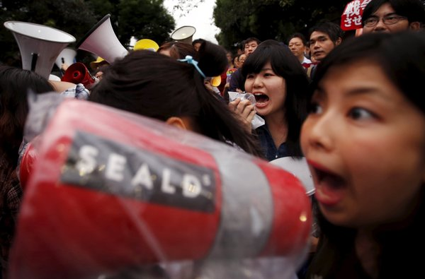

**A warrior spirit?**

****

****

Over the protest of pacificists and leftist politicians, Prime Minister Shinzo Abe recently secured passage of legislation authorizing overseas combat missions for Japan’s military, overturning a decades-old policy of reserving the use of force for self-defense.

Enacted after WWII, the policy curbed Japan’s military activity abroad. Now the debate is how closely Japan wants to ally itself with U.S. military policy in Asia. One worry is that Americans will expect Japan to act as its “deputy sheriff” toward powerful countries like China and rogue states like North Korea. The debate ended after lawmakers began a brawl for control of the chairman’s microphone.   —*Diane Richard, writer, September 23*

Image: Yuya Shino/Reuters
 Source: Jonathan Soble, “Japan’s Parliament Approves Overseas Combat Role for Military,” *The New York Times,* September 18, 2015 

