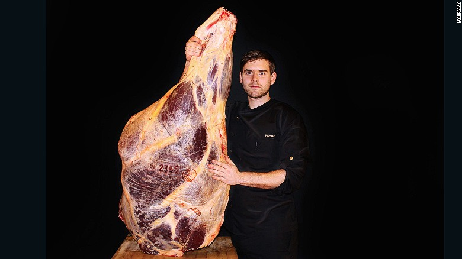

**Aged to perfection? **

****

Believe it or not, people are flocking to an exclusive restaurant in northeastern France to pay hundreds and thousands of dollars for meat that is over 15 years old. Yes, I said 15 years.

Using a technique called “hibernation,” the Polmard family has created a way to store meat over long periods. It involves the blowing of cold air at speeds of 75 miles per hour over beef kept in refrigeration reaching -45 degrees.

Butcher Alexandre Polmard says there is no loss of quality to the meat. So if you have some extra money to burn, make sure to get your reservations now, because the restaurant is booked up for months. And may I recommend packing some Tums, too? 

  —*Susan Hopson, Learning Innovations intern, October 18, 2016*

**

Image: Farmer, breeder and butcher Alexandre Polmard.

News source: Chris Dwyer, “What does the world’s most expensive meat taste like?” CNN, October 11, 2016

