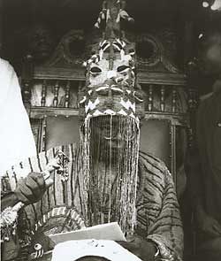

**Next in line?**

****

Yoruba kings, or *obas*, once surrounded themselves with beaded finery, palaces, courtiers, and servants. But even the king served at the pleasure of others. A king was not born into power. A council of kingmakers selected him from a pool of candidates, weighing each one’s fitness to take office. Once the king was installed, diviners checked in with the *orisha* (deities) each year to determine if the king still had divine support. If he didn’t: *adios*.  

Gross infractions, incompetence, or dereliction of duty could also result in the king’s ouster. In that case, the king was instructed to remove his crown and look inside it at the packs of medicines held within. This symbolic action marked the loss of his political power. So great was the medicines’ power, it could also lead to the loss of the former *oba*’s life.
       — *Alex Bortolot, Content Strategist, October 19, 2016*

**

Photo: Oba Idowu Owoaje Soludero II, crowned the Moloda of Odogbulu in 1971

Courtesy “Visual depiction of some traditional rulers,” hibe-online.com

*Timed to coincide with the U.S. election, “Next in line?” is a series that highlights how power is transferred or demonstrated among a variety of cultures represented in Mia’s collection.*

