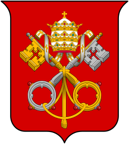

**Next in line?**

The succession of popes is rife with intrigue. The 900s, especially, when two popes were murdered and a series of anti-popes—rulers who challenged the legitimacy of the reigning pope—took power.  

After the death of Pope Clement IX, an arduous process of selection began, lasting four months. French and Spanish factions caused rifts among the cardinals. When no decision could be made concerning the three candidates, an unlikely candidate was proposed: Cardinal Altieri, an octogenarian. Because of his age, Altieri refused the post, offering up yet another selection. His protests were futile, and on May 11, 1670, he was crowned Clement X, assuming the name of his predeccessor. Clement X would go on to reign for six years, two months, and 24 days. Despite his foot-dragging acceptance of the role and his short tenure, he is remembered for his efforts to preserve peace throughout Europe.
 — *Gretchen Halverson, Media and Technology Assistant, October 21, 2016*

**

Photo: Coat of arms of the Holy See, Donald Lindsay Galbreath, *A Treatise on Ecclesiastical Heraldry*, 1930

*Timed to coincide with the U.S. election, “Next in line?” is a series that highlights how power is transferred or demonstrated among a variety of cultures represented in Mia’s collection.*

