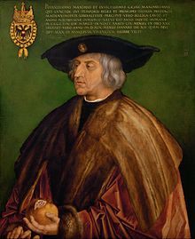

**Next in line?**

****

Maximilian I knew that behind any leader is a good propagandist. Especially when your empire eclipses much of Europe.

An impressive example of propaganda, think of *The Triumphal Arch of Maximilian I* as the *ur*-billboard. At the time of its initial publication, *The Triumphal Arch* was the largest print ever completed. Though Maximilian I, a Habsburg king who would become the Holy Roman Emperor, was not rich enough to complete major self-aggrandizing monuments, he seized on the idea that a printed equivalent—by Albrecht Dürer, no less—could effectively make his case for the right to rule. Fully assembled, the print measures more than 11 feet tall by 9 feet wide. Which is larger—if no more arresting—than the coffin he traveled with from 1514 until his death five years later.
   — *Diane Richard, writer, October 20, 2016*

**

Image: Portrait by Albrecht Dürer, 1519 (Kunsthistorisches Museum, Vienna). Maximilian holds his personal emblem, the pomegranate.

*Timed to coincide with the U.S. election, “Next in line?” is a series that highlights how power is transferred or demonstrated among a variety of cultures represented in Mia’s collection.*

