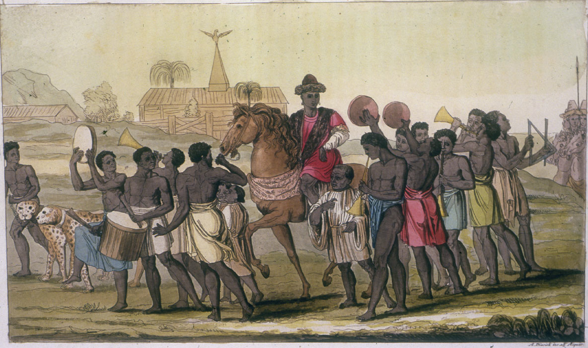

**Next in line?**

****

What’s the biggest animal in the jungle? The elephant. Who’s the most powerful leader in the Benin Kingdom of Africa? The *oba*, or king. What symbol of power most effectively conveyed authority? The *oba*’s carved tusk, like this one. Big time. 

For the *oba*, the succession of power generally passed from father to son or brother to brother. Becoming and staying an *oba* wasn’t always a smooth ride, though. Who took the throne was sometimes disputed, spawning wars. And banishing your brother was not always the best solution, as Oba Uwaifiokun discovered in the 1400s. He exiled his brother Prince Ogun, only to be murdered by him in a nighttime ceremony in a market. Another leader, Oba Ezoti, only reigned for 14 days, after getting hit with a poisoned arrow at his coronation.    

  — *Susan Hopson, Learning Innovation Intern, October 19, 2016*

Photo: Wikipedia

*Timed to coincide with the U.S. election, “Next in line?” is a series that highlights how power is transferred or demonstrated among a variety of cultures represented in Mia’s collection.*

