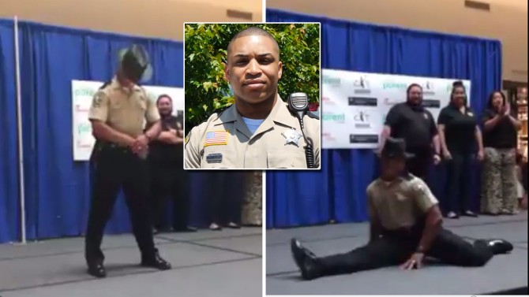

**Dancing deputy?**

****

Deuntay Diggs, a sheriff’s deputy from Stafford County, Virginia, is dancing to bring attention to a nationwide problem: negative perception of law enforcement. 

Videos of the dancing deputy have twice gone viral. The latest was at a pep rally, where he danced solo to Beyonce’s “Formation.” Diggs hopes his videos portray a positive message during a time when relationships between citizens and law enforcement are fraught. Dance on Deputy Diggs, dance on.  
       —*Susan Hopson, Learning Innovations intern, October 25, 2016*

**

Photo: Inside Edition

News source: Perry Stein, “The Dancing Beyonce Deputy: He has gone viral twice for his dance moves,”
 *The Washington Post*, October 19, 2016

