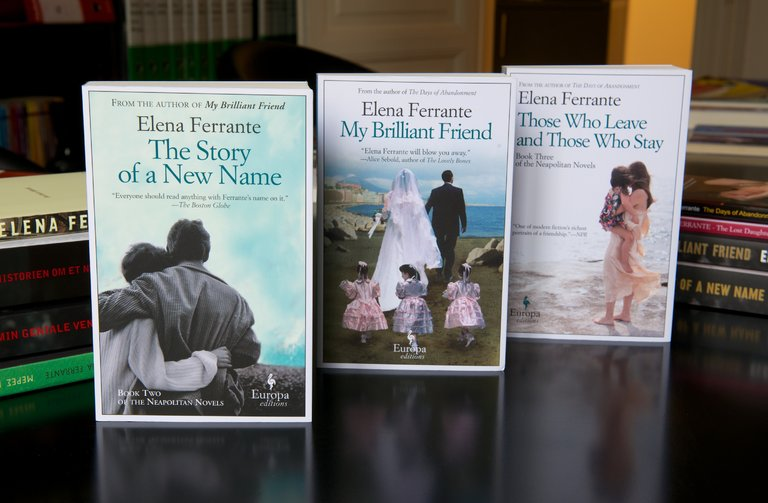

**A mystery unmasked?**

****

Literary fans of the Naples–based fictional quartet written under the pseudonym of Elena Ferrante are outraged at the possible unmasking of their beloved yet publicity-averse author. 

A subject of avid speculation, the author’s identity has been fiercely guarded—and should remain so, say her readers. Still, mysteries are made to unravel, and numerous names have been floated. The latest is Anita Raja, an Italian translator. According to a recent article by an investigative journalist, Raja’s coffers have swelled apace with the series’ publication cycle. Fans are crying foul for violating the author’s privacy and also for going after the pen behind two female protagonists who exert power over their lives and fates.       —*Diane Richard, writer, October 6, 2016*

 Photo: Chris Warde-Jones for *The New York Times*

News source: Rachel Donadio and Jennifer Schuessler, “Who Is Elena Ferrante? Supporters Say NOYB,” *The New York Times*, October 3, 2016

