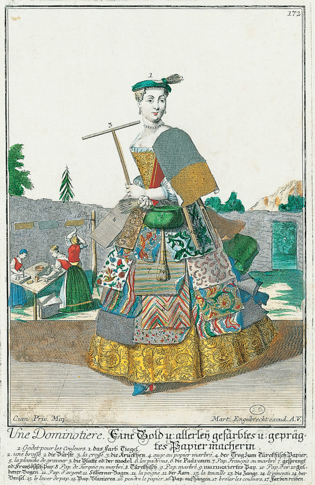

**Lethal beauty?**

****

Allow me to interject something bitter into this vibrant domestic scene. Don’t see it? Arsenic was once common in colorful wallpaper, like the spotted pattern you see before you.

A recent book, Lucinda Hawksley’s *Bitten by Witch Fever: Wallpaper & Arsenic in the Nineteenth-Century Home* (Thames & Hudson), chronicles the rise of poisonous pigments in the 19th century through the burgeoning British wallpaper trade. Arsenic allowed for the mass production of eye-popping shades of green, blue, and yellow, which ran riot across Victorian-era walls. The famous wallpaper designer William Morris even got rich on his family’s arsenic mines. Still, Morris claimed “witch fever” was mere hysteria. Tell that to the parents of children stung by the poison, which caused skin lesions and worse—even death.                     —*Diane Richard, writer, November 9, 2016*

 Illustration: Germany, 1735–40, courtesy Bibliothèque des Arts Décoratifs, Paris

News source: Allison Meier, “Death by Wallpaper: The Alluring Arsenic Colors that Poisoned the Victorian Age,” *Hyperallergic,* October 31, 2016

