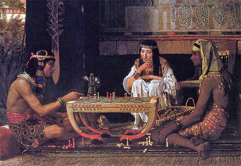

**Face-off between two Grands?**

****

In a move that has prompted outrage among players worldwide, Saudi Arabia’s top cleric has labeled chess “haram”—or forbidden for Muslims—claiming it arouses “enmity” and “hatred” among players.

Unlike, say, the shoot-em’-up video game *Grand Theft Auto V*, chess is not exactly new to the Islamic world, nor is it violent. Muslims in India or Persia have been playing chess since the 6th or 7th century, and they are credited with introducing the game to Europe.

The Grand Mufti made the decree—or *fatwa*—on his weekly television program, calling chess “a waste of time and an opportunity to squander money.” In response, the chess world’s Grandmaster Garry Kasparov tweeted: “Saudi Arabia trying to ban chess is stupid, but we should be more concerned about their bans on human rights and democracy.” 

 *                  —Diane Richard, writer, February 2*

**

Image: Sir Lawrence Alma-Tadema, *Arab Chess*(Source: Wikimedia)
 Source: Kareem Shaheen, “Chess forbidden in Islam, rules Saudi mufti, but issue not black and white,”
 *The Guardian*, January 21, 2016

