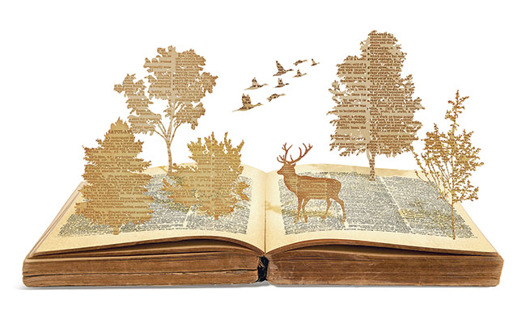

**Lost language of nature?**

****

We are in the midst of a sixth great extinction, a rapid loss of species unprecedented except for five prehistoric mass extinctions—of the dinosaurs, for one. Only this time, it’s largely man’s doing, as we warm the planet, transform natural spaces, and abandon what’s left of them for concrete cities. 

Along the way, as several new books note, we’re losing the language of nature—words like guzzle (the low spaces on barrier beaches that allow the tides to pass into inland marshes) and the distinctions between streams, creeks, and brooks. George Inness, who hailed the factory in this stream scene as a sign of progress, might not have worried about this—because there seemed to be no end of nature in the 1800s and because the triumph of man over it seemed inevitable and good. But a loss is a loss, and we can only be the lesser for it.

*—Tim Gihring, Editor*

*March 24, 2016*

**

**

**

**

**

**

**

**

**

Illustration by Jennifer Luxton for *Yes!*magazine, January 18, 2016

