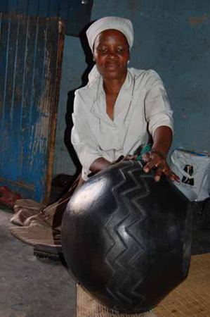

**Women at work**

****

Call it “lost in transaction.” When this pot was sold on the international art market, the name of the Zulu woman who made it was left behind. 

Only very rarely do we know the names of African artists. Sometimes that’s because different societies have different notions of individual creativity, and artist names are deemphasized. More often than not, it’s because Westerners didn’t think of African art as “art” and didn’t consider African artists “artists.” It was enough to know that a pot was “Zulu.” The name of its maker?  Not important.

Thankfully, times have changed. Today we know the names of many Zulu women potters, and their work is celebrated and highly sought-after.    *      —Alex Bortolot, Content Strategist*

**

Image: Artist Peni Gumbi shining a pot, *ArtThrob Magazine*, artthrob.co.za

*“Women at Work” celebrates Women’s History Month by highlighting female artists in Mia’s collection.*

**

