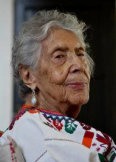

**Women at work**

****

 The granddaughter of former enslaved people, Elizabeth Catlett was an African American sculptor, painter, and printmaker known for producing politically charged works, focusing on the female human body and the struggle for civil rights. She fused visual elements of the African tradition with those of western Mexico. Many of her pieces celebrated famous African Americans as well as anonymous workers, like this female sharecropper. Catlett used art to explore and promote her progressive political views and to depict other strong black females in her works, defying the norms of white male artists. In her own words: “I have always wanted my art to service my people—to reflect us, to relate to us, to stimulate us, to make us aware of our potential.” *
           —* *Ellie Hohulin, Learning Innovation intern, March 9*

**

Image: Elizabeth Catlett, *The New York Times*, 2011

*“Women at Work” celebrates Women’s History Month by highlighting female artists in Mia’s collection.*

