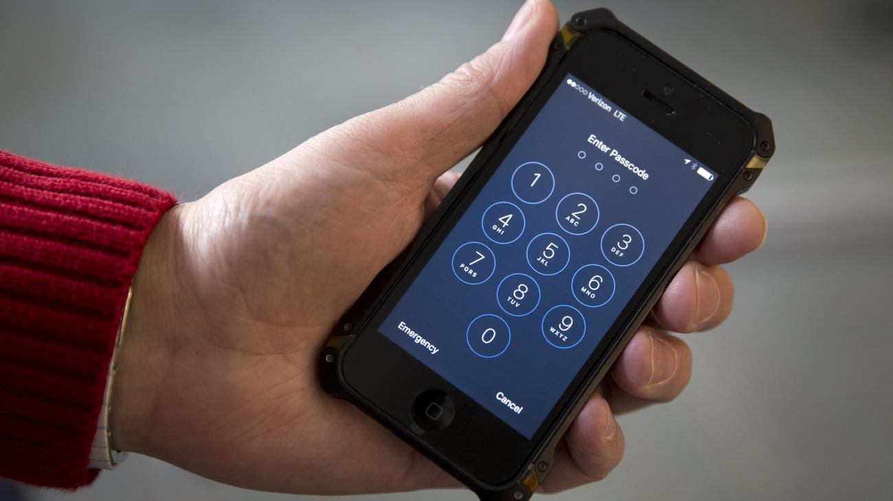

**Secrets not so secret?**

****

Recently, the FBI announced it had hired a third party to unlock the iPhone of an attacker in the December 2015 San Bernardino shootings. Apple refused to assist in the process, citing privacy concerns. Since then, a bug in the phone’s operating system shows a relatively easy way to gain entry to contacts and photos, with no need of fingerprints or passcoades.

This elaborate inkstand by Vincenzo Coaci is the 18th-century equivalent to an iPhone, in that it was a central tool in communication of the time. Full of secret compartments containing candleholders, a sander, an inkwell, and even a lever to make two doves kiss, the inkstand’s delightful surprises can only be uncovered by those in the know.                 *       **—* *Ellie Hohulin, Learning Innovation intern**, April 5
*Images: Carolyn Kaster/AP/2016

Source: Hayley Tsukayama, “Bug allowed open access to iPhone photos and contacts,” *The Washington Post*, April 6, 2016

