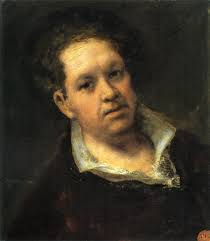

**Before the Selfie**

****

 The most renowned painter of the Spanish Court, Francisco José de Goya y Lucientes (1746–1828) is regarded as the most important Spanish artist of his day. His early career was spent painting luminous portraits of Spain’s royal family and aristocracy. Later, he painted scenes of political instability, warfare, and brutality that still disturb and chill today. 

Along the way, he made self-portraits that reflect his own evolution from brash young painter to observer of life haunted by all he had witnessed and lost, including his hearing and several children. In 1820, he made this tribute to his caregiver, Dr. Arrieta, an image of unflinching self-exposure and vulnerability.   *—Diane Richard, writer, May 14, 2016*

**

Image: WikiCommons, Museo Nacional del Prado, Madrid

*“Before the Selfie” highlights the popularity of the self-portrait in Mia’s collection before 2000. To see self-portraits by contemporary artists, visit “Beyond the Selfie” in Gallery 368, May 14–October 30.*

