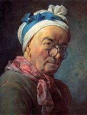

**Before the Selfie**

****

 You might call this a symbolic portrait. Like a self-conscious suitor who leaves certain books or magazines lying around his apartment before inviting a date in, Jean-Baptiste-Simeon Chardin has assembled the accountrement of the arts—sculpture, drawing, architecture, goldsmithing—and its rewards, most notably a prestigious medal, as though they were just sitting there on a desk. 

It’s a clever gambit, to create a self-portrait without ever showing his face. Indeed, it probably says more about how he wished to be seen than if we had seen him in the flesh (for comparison, a true self-portrait is shown here). And yet, by removing himself from the scene, he can also claim modesty. *—Tim Gihring, editor, May 25*

**

Image: Self-portrait, 1771, pastel, Musée du Louvre, Paris.

*“Before the Selfie” highlights the popularity of the self-portrait in Mia’s collection before 2000. To see self-portraits by contemporary artists, visit “Beyond the Selfie” in Gallery 368, May 14–October 30.*

