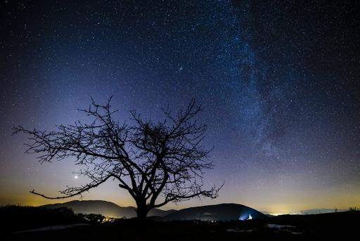

**Seeing stars?**

****

We’re losing the Milky Way to light pollution, says a recent study. One-third of humanity—and 80 percent of North Americans—can no longer see the sky’s creamy compote of stars. For the first time in the history of our species, entire generations of people have never seen our galaxy. The cause is electric lighting, mostly urban, which saturates the night sky. High-efficiency light sources like LEDs actually exacerbate the effect by casting a cool white light. The loss—to migrating species, astronomers, and dreamers alike—is cosmic.           —*Diane Richard, writer, June 15, 2016*

**

Photo: Peter Komka / AP

News source: “The Milky Way Is Disappearing,” *The Atlantic*, June 10, 2016

