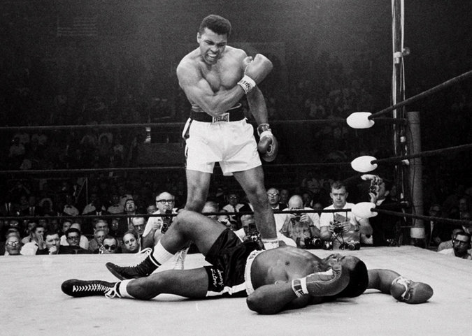

**The Greatest, no question**

****

The recent death of Muhammad Ali is the death of far more than an athlete. Born Cassius Clay, this son of Louisville, Ky., made history in the boxing ring and in the world —both as a heavyweight fighter and a heavyweight anti-war political figure. Self-dubbed the “greatest boxer of all time,” he was both a physical and verbal combatant whose rope-a-dope rhyming phrases, it’s been said, inspired rap. (Me! Wheeeeee!”) His memorial service gathered a rich cross-section of American figures—imams, rabbis, Native leaders, a priest, a former president—to praise this man who lived his life honestly, without apology. In Ali’s words: “I don’t have to be who you want me to be; I’m free to be who I want.”           —*Diane Richard, writer, June 16, 2016*

Photo: John Rooney, Associated Press

News source: “Muhammad Ali Dies at 74: Titan of Boxing and the 20th Century,” *The New York Times,* June 3, 2016

