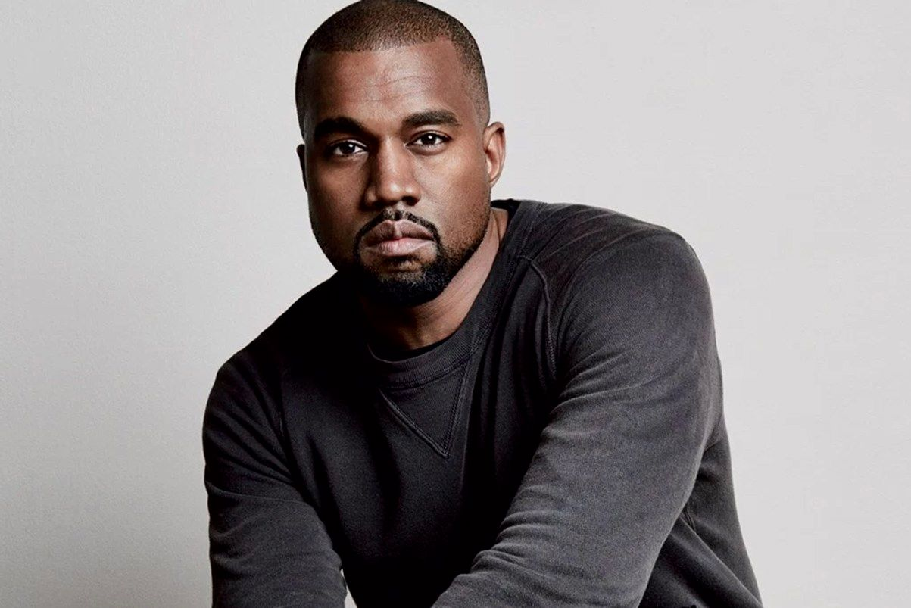

**Artists’ egos—Dalí to Kanye?**

 

 

Salvador Dalí once stated, “E​very morning upon awakening, I experience a supreme pleasure: that of being Salvador Dalí.”

​

Sound familiar?

With the announcement of Kanye West’s Saint Pablo tour, West is once again making headlines as one of the most controversial figures in pop culture. Resembling Dalí’s words, his latest track, S​aint Pablo, ​states: “​I know I'm the most influential, that T​IME ​cover was just confirmation, ​th​is generation's closest thing to Einstein.​” Certainly, artistic genius is, in part, born out of personality, daring, and ego. It’s up to you—and time—to judge whether Dalí, or Einstein, or an artist named Pablo (Picasso) laid the way for the likes of West.           *—A​lexandra Cole, intern, June 29, 2016*  

Photo: AJC.com 

News source: “Kanye West Shares Saint Pablo Tour Dates,”*B​illboard*, June 14, 2016 

Quote: Brainy Quote; Lyric: Lyric Genius

