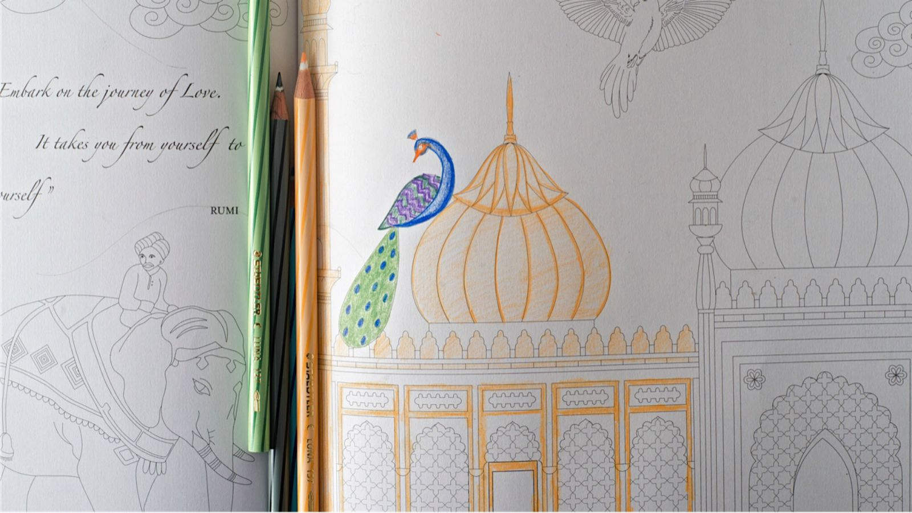

**A Mughal art revival—in coloring books?**

****

They were intricate and dense, every inch—and there were not many inches to begin with—encrusted with color, geometry, and superfine lines. These miniature paintings, perfected in the Mughal era of 1500s India, symbolized the merging of refined Persian culture with the cultures of the Indian subcontinent. By the 1700s, with western influences rising, they were passé.

Today, they’re being reincarnated—under western influence—as a source for adult coloring books. The rich decoration and intricate lines make an ideal foil for the accomplished colorist. And in India, where the books have become a hit, there is also a sense of pride: for aesthetic refinement, the Mughal era has been a tough act to follow.

—*Tim Gihring, editor, June 8, 2016*

**

Source: Qz.com, May 25, 2016

