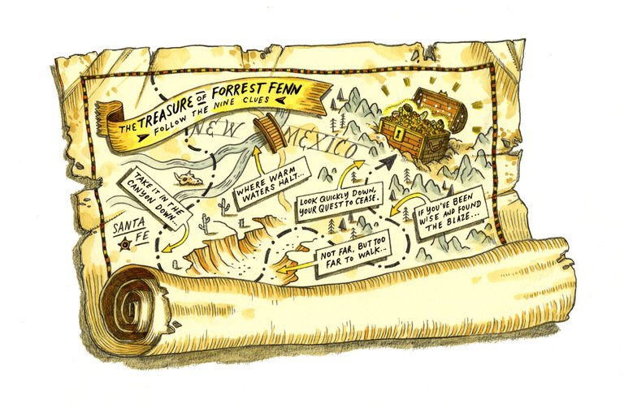

**Thrill of the treasure hunt?**

****

A Santa Fe man initiated an old-fashioned treasure hunt to shake people from their Netflix-induced trances and get them outside. Forrest Fenn, 85, an art dealer and Vietnam veteran, wrote a 24-verse poem studded with clues that lead to a treasure he buried, estimated at \$2 million. 

Over 65,000 people have hit the trails in search of the trove, which he claims is filled with gold coins, rubies, emeralds, and diamonds. While some searchers focus on the chance at a hefty payout, others suggest that the most precious treasure is found in the thrill of the hunt amid the vast wilderness of the Rocky Mountains. Either way,  just as he hoped, Fenn seems to have succeeded in giving Americans a reason to “get off their couches” and into the great outdoors—during the centenary of the National Park Service, no less.   —*Gretchen Halverson, intern, July 11, 2016*

Image: John Hendrix for *The New York Times*

News source: Fernanda Santos, “On the Hunt, ‘Where Warm Waters Halt,’ for a \$2Million Treasure,” *The New York Times,*July 5, 2016

