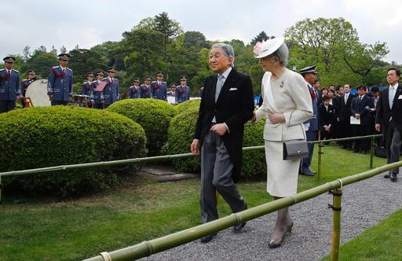

**Game of throne?**

****

A classic from Japan, *The Tale of Genji* relates the life and loves of the emperor’s son, Genji. Written by a noblewoman, Murasaki Shikibu, in the 11th century, it’s considered the world’s first pageturner. Spoiler alert: Genji never became emperor, but his grandson, Niou, did.

Recently, Emperor Akihito of Japan announced plans to abdicate the throne before he dies, passing it to his son, Crown Prince Naruhito. The last emperor to abdicate was Emperor Kokaku, in 1817. What tale might Murasaki spin from this news?     
 —*Diane Richard, writer, July 14, 2016*

**

Photo: Shizuo Kambayashi/Agence France-Presse — Getty Image

News source: Motoko Rich, “Emperor Akihito of Japan Plans to Abdicate Throne, Broadcaster Says,” *The New York Times,* July 13, 2016

