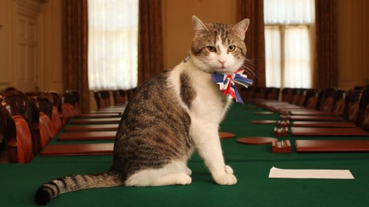

**The cat’s meow?**

 

Meet Larry, Chief Mouser to the Cabinet Office, 10 Downing Street. In the wake of Britain's major political upheavals—Brexit and a new PM, to name two—one thing is set to remain the same: Larry. 

Cat fanciers had worried that Larry might be ousted, what with the change of UK Prime Ministers from David Cameron to Theresa May. But it looks like L​arry has another life at the Downing Street household, where he will continue his official duties of posing regally for the press and catching rats. Although Larry is not the first Chief Mouser to the Cabinet Office, the lucky cat has held the unofficial title since 2011. In a time of dog-eat-dog politics, this familiar feline face may just be the heart-warmer we’ve all been longing for.         *—A​lexandra Cole, intern, July 20, 2016*  

Photo: WPA Pool/Getty Images 

News source: “Larry the cat escapes Downing Street eviction,” B​BC NEWS. J​uly 12, 2016

