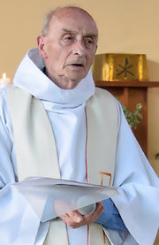

**Priest serves til his ‘last breath’**

****

****

In the latest wave of ISIS terror attacks, Father Jacques Hamel was brutally killed while saying Mass in St.-Étienne-du-Rouvray, France, a tragedy that left a parishioner wounded and rocked the working-class town in Normandy.

Fr. Jacques, age 85, laughingly responded to those who urged him to retire, noting, “I’ll work until my last breath.” He kept up his busy schedule of masses, baptisms, and looking after parishioners. His dedication and humility did not go unnoticed, as parishioner Jean Baya, a plumber, remarked, “He was just so helpful. It really hurts me that he’s gone.” Father Mputu Amba, a fellow priest in the Archdiocese of Rouen, remarked, “To leave us just as he was celebrating Mass must have been some kind of blessing for him, despite the tragic circumstances.”   —*Ali Coffman, intern, July 27, 2016*

Photo: St.-Étienne-du Rouvray Parish

News source: Adam Nossiter and Hannah Olivennes, “Jacques Hamel, 85, a Beloved French Priest, Killed in His Church,” *The New York Times,* July 26, 2016

