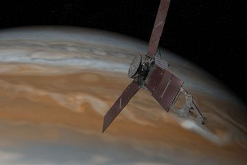

**Galactic romance?**

 

 

Just in time to celebrate, the unmanned spacecraft *Juno*reached Jupiter on July 4, 2016, nearly five years after it launched its 540-million-mile journey. Though we have come a long way since Galileo first discovered Jupiter and its moons on January 7, 1610, this was not the first time a manmade object has reached the gas planet. That NASA triumph dates to 1995. This mission differed, however, in purpose: *Juno*is helping us better understand Jupiter’s origins, its water content, and atmospheric conditions. 

*Juno* is scheduled to make impact with Jupiter in February 2018, upon completing its mission. For Roman mythology buffs, that collision will have layered meaning: the goddess Juno is married to the god Jupiter. So, naturally, some friction is likely to occur.*  —A​lexandra Cole, intern, July 6, 2016*  

Photo: N​ASA/JPL­Caltech

News source: CNN, “’​Welcome to Jupiter!' NASA's Juno space probe arrives at giant planet,” J​uly 6, 2016

