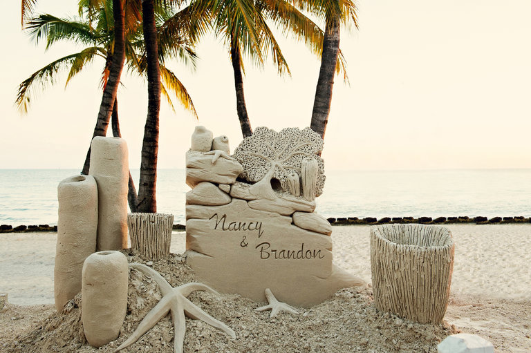

**Sandy moments in time**

****

The Buddhist monks who build mandalas don’t expect them to last (though this one has, to honor persecuted Tibetans). Indeed, building with sand has long been a metaphor for ephemeral acts, whether intentional or simply foolish. And the latest wedding trend may be a bit of both: sand sculptures.

Couples are commissioning these beachy counterparts to the faded fad of ice sculptures—of their names and wedding date, pets, dolphins, bottles of rum—for hundreds and sometimes thousands of dollars. After a seaside reception, they are abandoned to wind and water. Not the best analog for a lasting marriage, perhaps, but certainly sustainable.*                    —Tim Gihring, editor, July 7 *

**

Image: New York Times, July 7

