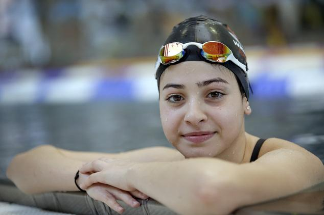

**Olympics: Already a winner **

****

With the first ever Refugee Team at the 2016 Rio Olympics, all eyes have turned to one astounding athlete, swimmer Yusra Mardini.

An 18-year-old Syrian refugee currently residing in Germany, Mardini has had an extraordinary trip to the Olympics. During her escape from Syria, the dinghy carrying Mardini, her sister, and 20 other refugees began sinking in the Mediterranean Sea hours away from land. Mardini and her sister, the strongest swimmers on board, pushed the dinghy safely to shore. 

Representing the refugee population at the Olympics, Mardini won her 100m butterfly heat; unfortunately, though, she did not advance. She has now set her eyes on the 2020 Tokyo Olympics.      —*Alexandra Cole, Intern, August 11, 2016*

**

Photo: Storypick, “The Inspiring Yusra Mardini: An Olympic Refugee Swimmer Who Saved 20 Lives From A Sinking Boat.”

News source: “Team Refugee athlete Yusra Mardini wins her 100m butterfly heat,” *NBC Olympics,* August 6, 2016

