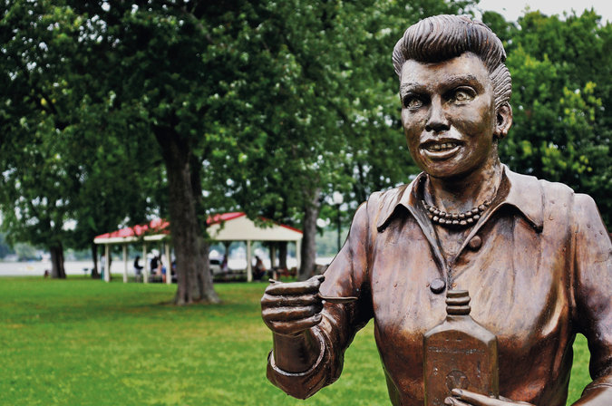
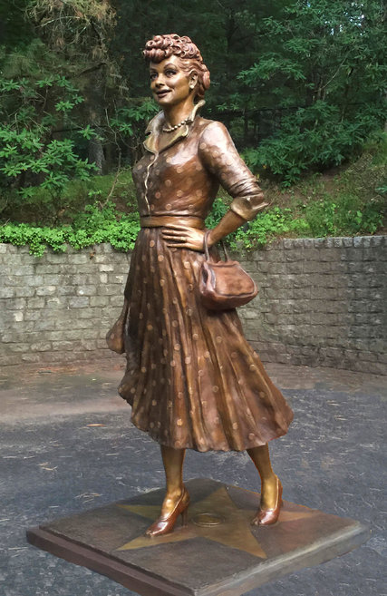

**Here’s Lucy?**

****

Residents of Celoron, N.Y., would appreciate this rear view of their hometown hero, Lucille Ball. 

Especially compared to Celoron’s statue loved by none—nicknamed Scary Lucy (above). A social media sensation, Scary Lucy drew visitors—but for all the wrong reasons. Unveiled in 2009, the bronze lacked all that made Ball famous: joy, wit, beauty, humor. A substitute statue recently arrived on the scene (right). Today, Celoron’s mayor says: “You can stand at any angle and look and say, ‘That’s Lucy.’”       —*Diane Richard, writer, August 11, 2016*

**

Photos: Top: *The Post-Journal*, via Associated Press; bottom: via Reuters

News source: Liam Stack, “Here’s Lucy! ‘Scary’ Statue Is Replaced With One That Looks Like Her,” *The New York Times,* August 9, 2016

