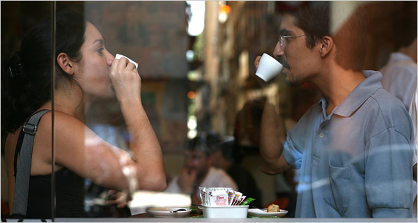

**Olympics: Caffeine crisis in Rio**

****

Brazil has been the largest contributor to the global coffee market for 150 years. As such, tourists to Rio’s Summer Olympics are likely savoring the excellent, locally sourced cuppa for less than \$2. But will Olympic athletes go the extra mile for their caffeine fix? Because no coffee is available to athletes within the Olympic Village. 

Even though Coca-Cola, the beverage sponsor for this year’s Games, sells coffee products through its Gold Peak brand, it isn’t on the menu in the Olympians’ dining facilities. The solution? One would have to brave Rio’s new—and reportedly highly flawed—transportation system to find a café elsewhere in the city. Now *that* deserves a Black Gold medal.
   —*Stanilas Walden, intern, August 10, 2016*

**

Photo source: *The New York Times*  
 News source: Brian O’Connor, *Extra Crispy*, ‘There is No Coffee in the Olympic Village,’ August 5, 2016

