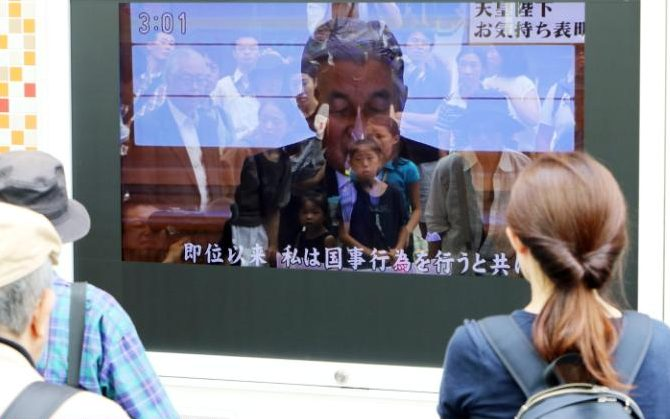

**An emperor’s screen time?**

****

This painted screen takes a very different form from the digital screen that recently showed Japan’s hereditary leader, Emperor Akihito.

In a rare TV appearance that riveted Japan and the world, Emperor Akihito, age 82, announced his desire to abdicate the throne, one his family has held for almost 2,700 years. If he resigns, his son, Crown Prince Naruhito, 56, would succeed him. Still, the role of emperor is lifelong, and this change would be the biggest transformation of the monarchy since World War II. Oh, and there’s one more parallel: the subject of this painted screen is another emperor who abdicated.  —*Diane Richard, writer, August 24, 2016*

**

Photos: REX

News source: Jonathan Soble, “At 82, Emperor Akihito of Japan Wants to Retire. Will Japan Let Him?” *The New York Times,* August 7, 2016

