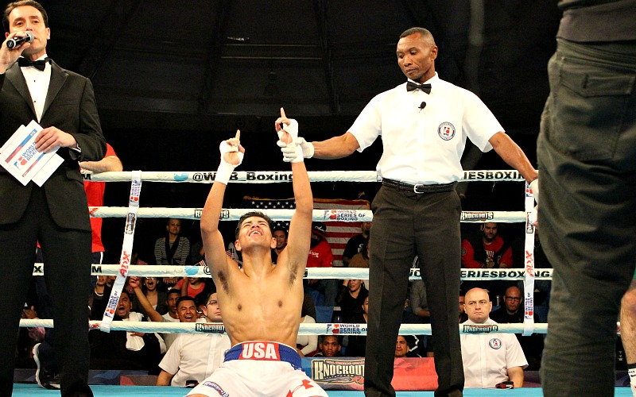

**Olympics: I heart for stag nights?**

****

I’ve never been to a boxing match, and chances are good I’ll never go. I’m also unlikely to watch Team USA’s bouts starting on August 9. No stomach for it. 

Nevertheless, I love stories and films about boxing: *When We Were Kings*, the 1996 documentary about the “Rumble in the Jungle” between Muhammad Ali and George Foreman, and *The Fighter*, the 2010 flick about supreme family dysfunction, crack addiction, and wicked 80s Lowell, Mass., hair. And, of course, *Rocky*, the original. Last year’s *Creed* also had heart. Boxing films put the human drama on center stage, with all its hope, ugliness, ego, and sweat. There’s always a hero, a villian, and a narrative arch. The drama of Bellows’ boxers leaves me breathless.     
       —*Diane Richard, writer, August 4, 2016*

**

**

Photo: Boxer Carlos Balderos, the first member to qualify for the Rio 2016 Olympic team, *The Los Angeles Times*

