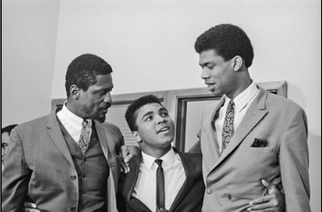

**Olympics: The boycott of ’68**

****

Lew Alcindor was arguably the world’s greatest basketball player in 1968, though he was still in college. He was 7 feet 2 inches tall and seemingly unstoppable, leading to headlines like, “Can Basketball Survive Lew Alcindor?” The United States Olympic Team wanted him badly for that year’s games in Mexico City. 

Alcindor, however, didn’t want the Olympics. Neither did many American black athletes, who felt hypocritical supporting a country that didn’t support them. Alcindor, who soon changed his name to Kareem Abdul-Jabbar, was one of the few who stayed away. “Yeah, I live here, but it’s not really my country,” he said on the *Today* show. Two athletes who did participate raised their fists in a Black Power salute—an iconic image that overshadowed Alcindor’s protest. But in his absence, Alcindor sent the ultimate statement: I refuse. 

          —*Tim Gihring, editor, August 4, 2016*

**

Photo: Alcindor (right) discussing racism with Muhammad Ali (center) and Bill Russell in 1967.

Source: Bettmann/Corbis

