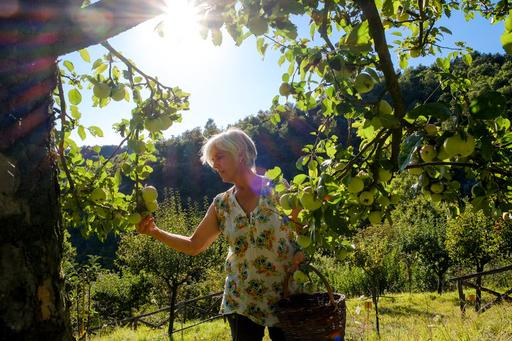

**Bearing ancient fruit?**

****

In the palm of Baby Jesus’ hand is a luscious-looking apple. What type of apple, though, is what most interests Isabella Dalla Ragione.

Ragione is an “arboreal archaeologist” dedicated to conserving the heirloom fruits of Italy. She turns to Renaissance paintings to identify species no longer present in the produce aisle, then hunts for their seeds to graft on her trees in hopes of resurrecting them. Today, her orchard is full of endangered fruits: cherries, figs, apples, pears, peaches, quinces, and other species. A century ago, Italians had some 100 types of apples to eat; today, 80 percent of crops consist of just three varieties. —*Diane Richard, writer, September 15, 2016*

**

Photo: Francesco Lastrucci for *The New York Times*

News source: Elisabetta Povoledo, “Italian Grows Forgotten Fruit. What She Preserves Is a Culture,” *The New York Times,* September 15, 2016

