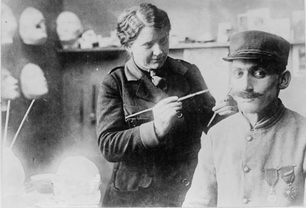

**Making faces?**

****

This painting depicts a wounded soldier who returns from the Crimean War into the embrace of his family.

Many soldiers from WWI wished for a homecoming so warm. Instead, those who survived the horrors of war often returned with breathtaking injuries—to faces, to limbs, to psyches. A fascinating new book, *Grand Illusions: American Art and the First World War*, tells the story of Anna Coleman Ladd, an American sculptor who applied her skills to make prosthetics for soldiers left with “broken faces.” Her work was heaven sent, as one soldier attested: “The woman I love no longer finds me repulsive, *as she had the right to do*.” —*Diane Richard, writer, September 15, 2016*

**

Photo: Library of Congress

News source: Allison Meier, “The Sculptor Who Made Masks for Soldiers Disfigured in World War I,” *Hyperallergic,* September 8, 2016

