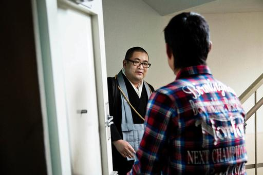

**‘You clicked?’**

****

Seems everything these days is available over the internet. Even, in Japan, freelance priests.

Amazon.com is now making priests available by housecall. These gig priests conduct traditional rituals, particularly those related to funerary customs, for people no longer connected to their familial temples—but who haven’t abandoned religion altogether. For their efforts, the priests receive about 70 percent of the shopping-cart proceeds, with the balance claimed by Amazon. As with everything the mass online retailer does, the upsides are convenience and clear pricing. The downsides? A disconnection from neighborhood providers. Temple leaders are not fans of the new offering.
 —*Diane Richard, writer, September 21, 2016*

**

Photo: Ko Sasaki for *The New York Times*

News source: Jonathan Soble, “Japan’s Newest Technology Innovation: Priest Delivery,” *The New York Times,* September 20, 2016

