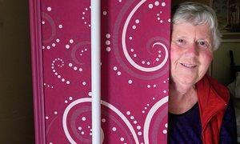

**DIY down under?**

****

New Zealanders tend to be straight shooters. So perhaps it’s no surprise that a group of seniors on the South Island has bonded together over death. These DIYers have formed a Kiwi Coffin Club to craft their own personalized coffins.

The goal is not only cheaper funerals, they say, but also self-expression. Much like this glorious lobster coffin, the burial boxes they’re constructing project the makers’ personalities. Former palliative care nurse Katie Williams, pictured here, founded the first club of its kind in 2010. Since then, the coffin clubs have multiplied to a dozen. As Williams said: “There is a lot of loneliness among the elderly, but at the coffin club people feel useful, and it is very social. We have morning tea and lunch, and music blaring, and cuddles.”
 —*Diane Richard, writer, September 28, 2016*

Photo: Katie Williams

News source: Eleanor Ainge Roy, “The coffin club: elderly New Zealanders building their own caskets,” *The Guardian,* September 22, 2016

