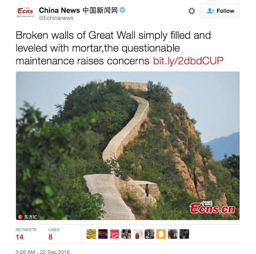

**A world-class remuddle?**

****

If this stoneware bowl had a crack in it—and if I owned it, it surely would—there’d be no missing the river of glue applied to repair the damage. 

Recently, the Great Wall of China suffered a similarly inelegant repair. To the dismay of cultural historians the world over, a five-mile stretch—considered to be the “most beautiful wild stretch of the Great Wall”—has been paved over with a substance resembling smooth cement. The “fix” along the Suizhong section is a gift for skateboarders; not so much for preservationists. “This was vandalism done in the name of preservation,” decried a local park officer. “Even the little kids here know that this repair of the Great Wall was botched.” An investigation is under way.  —*Diane Richard, writer, September 28, 2016*

**

Photo: *screenshot via @Echinanews/Twitter*

News source: Claire Voons, “Shoddy Restoration Smooths Over a Stretch of China’s Great Wall,” *Hyperallergic,* September 23, 2016

