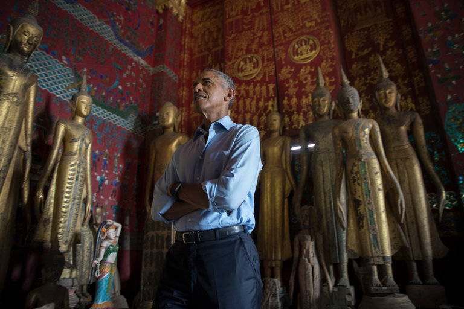

**Out of the shadows?**

****

For Cy Thao, the shadow war in Laos and the struggles of displaced Laotians—including the artist’s friends and family—were as plain as the nose on his face. 

Recently, President Obama acknowledged America’s secret war in Laos and the deadly legacy it left. During the Vietnam War, the U.S. military dropped 80 million cluster bombs in Laos, causing countless deaths and maimings—even today. (In Laos, Pokemon Go players have been officially warned to watch their step.) As the first sitting American president to visit Laos, Obama toured a U.S.-funded center that searches for explosives and provides prosthetic legs. Then he took time to visit a temple, sip from a coconut, and savor a Southeast Asian afternoon.
   —*Diane Richard, writer, September 7, 2016*

Photo: Stephen Crowley, *The New York Times*

News source: Mark Landler, “Obama Takes a Detour to Reconnect With Southeast Asia,” *The New York Times,* September 7, 2016

