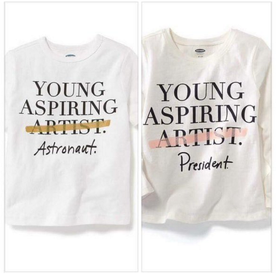

**Artistic Aspirations?**

****

When you were a kid, what did you want to be when you grew up? Mia wouldn’t exist without kids who dreamed of being artists. Sadly, Old Navy didn’t consider that before rolling out the toddler shirts below. 

In response, people took to social media to call out Old Navy for devaluing the arts. They also pointed out the irony that these designs were created by someone with at least some artistic training and skill.

On December 30, Old Navy released a statement: “…With this particular tee, as a result of customer feedback, we have decided to discontinue the design and will work to remove the item from our stores.”

*—Juline Chevalier, Head of Interpretation*

*December 31, 2015*

Photo credit: Via http://www.oldnavy.ca/products/cute-baby-shirts.jsp

News source: Loryn Brantz, “People Are Pissed Old Navy Is Selling These Offensive Baby Shirts,” *BuzzFeed*, December 30, 2015

