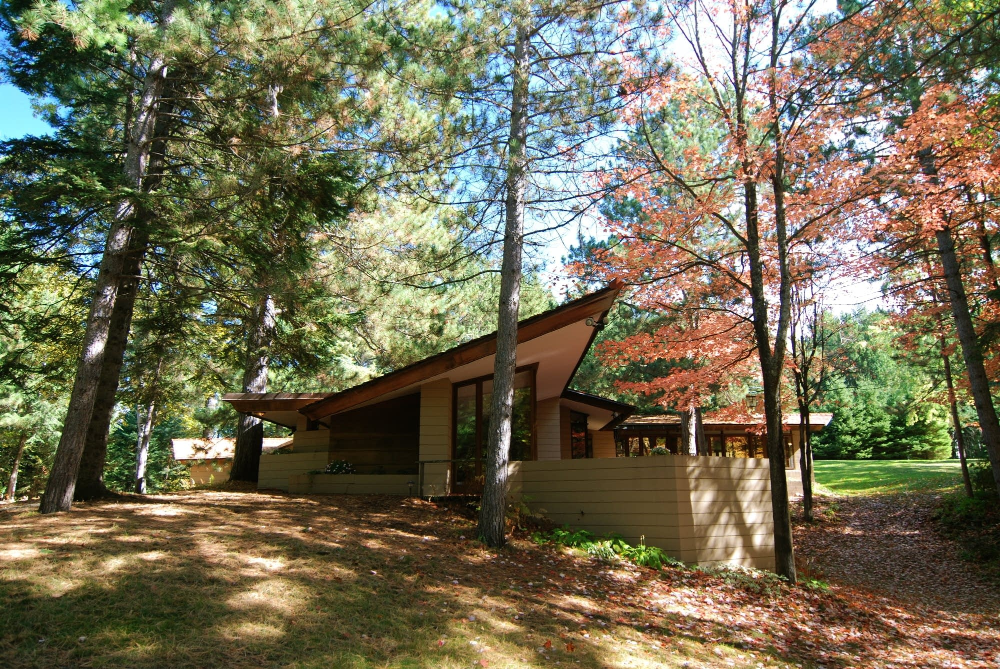

**New vistas for Wright home?**

A Frank Lloyd Wright–designed home in Cloquet, Minn., has been sold, dismantled, and shipped to western Pennsylvania. The home was built for Ray and Emma Lindholm in 1953 after their daughter, Joyce, learned of Wright’s work in an art history course at the University of Minnesota. Road construction and urban development were the primary reasons the owners decided to sell Wright’s Usonian design. Though Minnesota may be losing an architectural gem, the home will be reconstructed, piece by piece, in a park among many other homes designed by Wright and his apprentice in Acme, Pa. Fallingwater—arguably Wright’s most famous house—is in nearby Mill Run, Pa. Visitors will be able to tour the home next spring.        —*Gretchen Halverson, intern, June 29, 2016*

**

Photo: Courtesy of John Clouse | Frank Lloyd Wright Building Conservancy

News source: “Frank Lloyd Wright-designed house in Minn. Moved piece by piece to Pa.,” *MPRNews,* June 29, 2016

