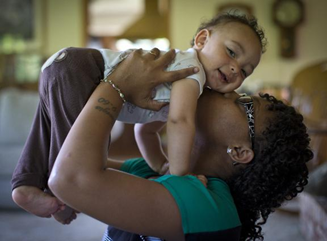

**Got Milk?**

****

A recent national study documented a widespread drop in childhood obesity among low-income families. Why? Increased rates of breastfeeding, possibly.

Of 43 states and U.S. territories surveyed from 2008 to 2011, just under half showed a downward trend in weight among 2- to 4-year-olds, with 20 states showing no change. A modest gain—err, loss—to be sure; nevertheless, it suggests that public health attempts to reduce childhood obesity may have turned a corner. 

*—Alex Bortolot, Content Strategist*

*August 7*

Credit: Renee Jones Schneider for *Star Tribune*.  

Source: Sabrina Tavernise, “Broad Decline in Obesity Rate seen in Poor Young Children,” *New York Times*, August 6, 2013

