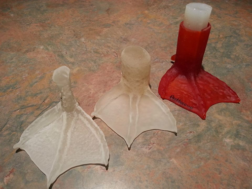

**Walk Like a Duck—in 3-D?**

****

Artists often prototype their work in materials like clay or wax. 3-D printing offers new ways to produce working samples of designs in progress. Design, print, test, refine, repeat: the technology has sped up the concept-to-product process and democratized design.

In Tennessee, Buttercup the Duck was born with a backwards foot. It was amputated and replaced with a printed prosthesis. An articulated human hand can be downloaded, printed, and assembled with about \$150 in parts and some mechanical know-how. 

*—Alex Bortolot, content strategist*

*July 11*

Photo: Feathered Angels Waterfowl Sanctuary

Source: Rusty Blazenhoff, “Amputee Duck Walks For the First Time With a New 3D-Printed Foot,” www.Laughingsquid.com, July 2, 2013

