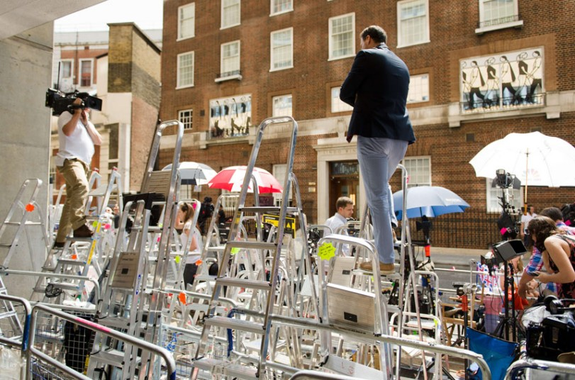

Royal Baby Stakeout

It’s been a long time coming—well, nine months, give or take—but the world must wait a little longer for William and Kate’s baby.  

180 photographers and journalists sit twiddling their thumbs in the parking lot outside St Mary’s Hospital, where Kate is to give birth. And rumors fly about cravings for veggie curry, an old technique to encourage stubborn kiddos to move on out (hot foods make babies hot foot it).  

Meanwhile, Princes William and Harry play polo.  Some things never change.

Image: Picture: AFP/GETTY IMAGES

Source: Charlotte Cowles, “Kate Middleton’s Revised Due Date, and More Royal Baby News,” NYMag.com, July 16, 2013

