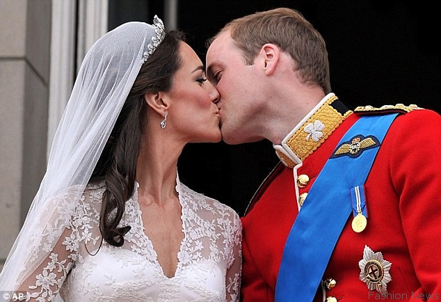

**All The World Is Expecting?**

William and Kate’s baby is due any minute now, as the world stands waiting. 

What world will this baby inherit? No one knows what the future holds. But we wish the new prince or princess the best—along the lines of what Shakespeare wrote:

This royal throne of kings, this sceptred isle, 

This earth of majesty, this seat of Mars, 

This other Eden, demi-paradise, 

This fortress built by Nature for herself 

Against infection and the hand of war, 

This happy breed of men, this little world, 

This precious stone set in the silver sea, 

Which serves it in the office of a wall 

Or as a moat defensive to a house, 

Against the envy of less happier lands,— 

This blessed plot, this earth, this realm, this England.

—William Shakespeare, “King Richard II,” Act 2, scene 1, c. 1595

