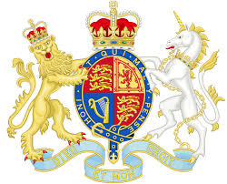

**Hello, Future Queen?**

****

William and Kate’s baby has arrived! What kingdom will she inherit? No one knows what the future holds. But we wish the new princess the best—in the words of Shakespeare:

This royal throne of kings, this sceptred isle, 

This earth of majesty, this seat of Mars, 

This other Eden, demi-paradise, 

This fortress built by Nature for herself 

Against infection and the hand of war, 

This happy breed of men, this little world, 

This precious stone set in the silver sea, 

Which serves it in the office of a wall 

Or as a moat defensive to a house, 

Against the envy of less happier lands,— 

This blessed plot, this earth, this realm, this England.

—“King Richard II,” Act 2, scene 1, c. 1595

-   *Alex Bortolot, Content Strategist, July 22, 2013*

