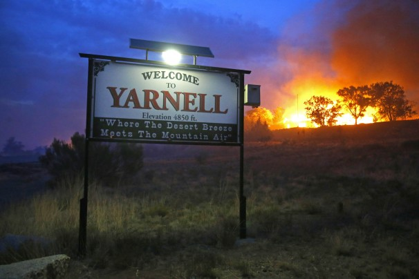

**Trial by Fire?**

****

The Yarnell Hill wildfire in Arizona is a tragic reminder of fire’s unpredictability. Since the 1970s, forecasters have used computer models to predict the paths of wildfires. Yet fires today behave much differently than in the past. 

So, what’s changed? Increased drought. Reduced fire suppression resources. And most significantly, the popping up of many subdivisions in areas of high fire risk. The distressed people in this scene by Joseph Wright of Derby watch helplessly as their home is overtaken by fire, just as many residents of Prescott, Arizona, have in recent days.

-   *Amanda Thompson Rundahl, MIA educator, *

*July 5*

Source:“As Arizona fire rages, scientists warn of more unpredictable blazes,” *LA Times*, July 3, 2013

