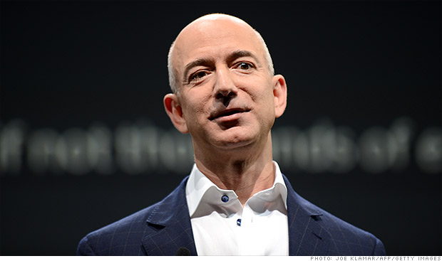

**Bezos—or Bust?**

****

In 1856, when the London *Times* in this painting announced the end of the Crimean War, newspapers were the sole conduit of current events. The *Washington Post* was established 21 years later, and its founders couldn’t imagine the Internet or its devastating impact on their business model. 

On August 5, Amazon.com CEO Jeff Bezos paid \$250 million in cash for the struggling paper. Can “the ultimate disruptor” of the book industry shake things up at the *Post* and bring us the next generation of 

e-newspapers? Stay tuned.

-   *Amanda Thompson Rundahl, MIA educator, *

*August 8*

Source: Adam Hartung, “Be Glad Jeff Bezos Bought *The Washington Post*,” *Forbes*, August 6, 2013

