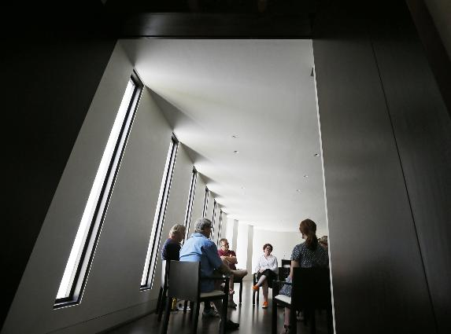

**Coffee—and Coffin?**

****

Modeled after the “café mortels” that began in France and Switzerland, philosophically inclined Americans are starting to see that a little discussion about death can be surprisingly calming. Currently, there are 40 cities—including our own Twin Cities Death Café—where these salon-style groups meet regularly to talk death, dying, and fears about the great beyond. Group members are finding that their conversations about mortality teach them a great deal about life, just as von Stuck’s *Portrait of Beethoven*, informed by the composer’s death mask, reveals more about Beethoven’s life than his death.

*—Courtney Algeo, writer*

*July 24*

**

Photo: Jerry Holt, *Star Tribune*

Source: Bill Ward, “The Death Cafe discussion group steers its members on how to live,” *Star Tribune*, July 24, 2013 

