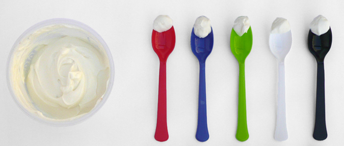

**Do fancier utensils make tastier morsels?**

****

A recent study showed that your sweet tooth may be enhanced by a sweetly designed spoon. Among the findings: a larger, heavier utensil is thought to serve up sweeter food than its lighter counterpart. So does a black spoon. Cutting cheese with a knife imparts extra saltiness to your palate, and so will any blue utensil, and lighter tools make food seem richer. Sadly, fancy utensils don't appear to make the taste of food more pleasurable; indeed, they may only serve to reflect your good taste.

*—* *Jessica Naithani, project coordinator, Design and Editorial*

*July 10*

Source: “7 ways the utensils you use change the taste of food,” *FastCompany Design*, July 10, 2013 

