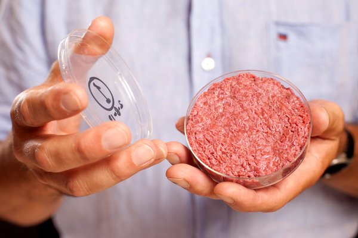

**Where’s the Beef?**

****

Love an expensive burger? How about a \$325,000 burger grown in a lab? A tasting of the first in vitro burger took place in London this week, thanks to a toothy investment into cruelty-free meat production by Google founder Sergey Brin.

Considered to be ‘future food,’ the hamburger was made from cow muscle grown in a lab over two years. Critics called the fried, low-fat burger dry and flavorless; however, admirers say such tissue production deserves funding if we are to feed our ever meat-loving planet. 

*—Diane Richard, writer*

*August 7*

**

Photo: David Parry/Press Association, via European Pressphoto Agency

Source: HENRY FOUNTAIN, “A Lab-Grown Burger Gets a Taste Test,” *New York Times*, August 6, 2013 

